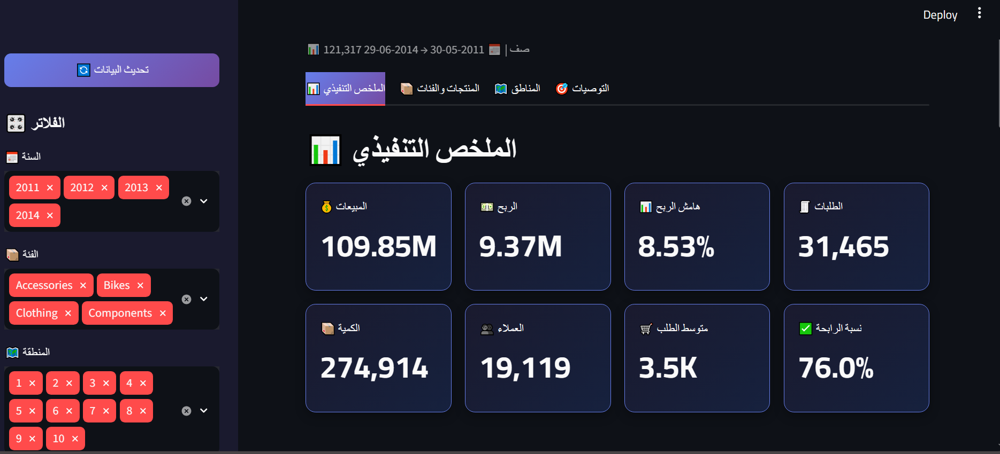

# 🚲 AdventureWorks Sales Analysis


> من قاعدة بيانات SQL خام إلى لوحة تحكم تفاعلية — مشروع ETL كامل مع تحليل تجاري.




"الإعدادات الحساسة في .env (غير مرفوع). انسخ .env.example إلى .env وعدّل القيم."


---

## 📋 نظرة عامة

مشروع **ETL + Analysis + Visualization** يستخرج بيانات مبيعات AdventureWorks من MySQL، ينظفها، يبني Star Schema، ويقدمها في لوحة Streamlit تفاعلية مع توصيات تجارية.

**الحجم**: 121,317 صف | **الفترة**: 2011 → 2014

---

## 🎯 الاكتشاف التجاري الأهم

**المشكلة ليست في منتج معين — بل في فوضى التسعير بين المناطق.**

منتج `Road-250 Black, 44`:
- السعر المعروض: $2,443
- التكلفة: $1,555

| المنطقة | سعر البيع | النتيجة |
|:---:|:---:|:---:|
| 9 | $2,331 | ✅ ربح 33% |
| 8 | $2,197 | ✅ ربح 28% |
| 4 | $1,565 | ❌ خسارة -8% |
| 2 | $1,373 | ❌ خسارة -15% |

**نفس المنتج — فرق سعر 70%.**

---

## 🛠️ التقنيات

- **Python 3.13** + pandas + SQLAlchemy
- **MariaDB** (AdventureWorks 2019)
- **Streamlit** + Plotly (اللوحة)
- **DuckDB** (تحويل Parquet إلى CSV)

---

## 📁 هيكل المشروع
AdventureWorks/
├── ETL.ipynb # خط أنابيب ETL كامل
├── analysis.ipynb # التحليل التجاري
├── dashboard.py # لوحة Streamlit
├── README.md
├── TECHNICAL_NOTES.md
├── requirements.txt
├── dashboard.png
└── output/
└── adventureworks.csv
---

## 🚀 التشغيل

```bash
pip install -r requirements.txt
streamlit run dashboard.py
📊 ما تعرضه اللوحة
4 تبويبات: ملخص تنفيذي، منتجات، مناطق، توصيات.

8 KPIs مباشرة.

فلاتر جانبية: السنة، الفئة، المنطقة.

رؤى ذكية تلقائية.

👤 المؤلف
BASSAM TAREK

📄 الترخيص
MIT License

